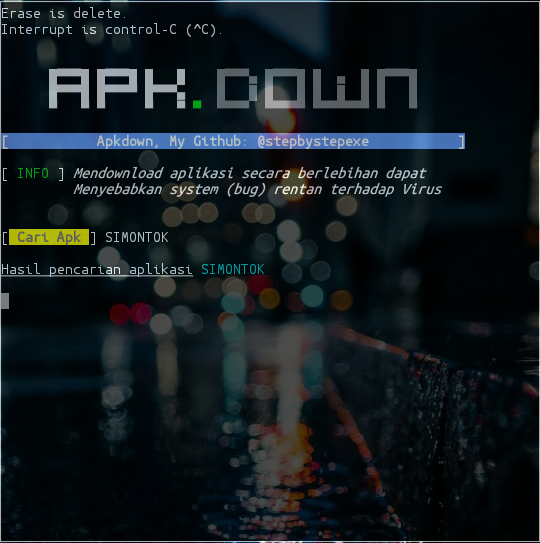

# Apkdown:
**```Download```** adalah transmisi file dari internet ke komputer client/pengguna dapat dikatakan juga proses penerimaan atau pengambilan file dari internet/server ke komputer pribadi.
#### Screenshot:

#### Cara Menginstall:
```
pkg update && pkg upgrade
apt-get install git
apt-get install python
git clone https://github.com/stepbystepexe/Apkdown
cd Apkdown
ls
python3 apkdown.py
```
```
pip3 install -r requirement.txt
```
#### Kontak:
+ Email d_q16x@outlook.co.id
+ WhatsApp https://tinyurl.com/wel4alo
#### Paypal:
+ Onclick https://bit.ly/3dcEQcN
#### LiberaPay:
<noscript><a href="https://liberapay.com/stepbystepexe/donate"></a></noscript>
>**Created by Nedi Senja**
